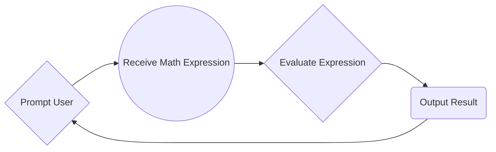

# Create a Calculator

Welcome to your first Project! We'll be creating a **Calculator** using everything we've learned to this point.

Your calculator(s) should follow this flow:

### Simple Calculator

Extensions to calculator:

 - Continue until the phrase 'break' is received
 - Display both entered and evaluated results on one line
 - Keep track of past expressions and save to a file upon close (Logging)
